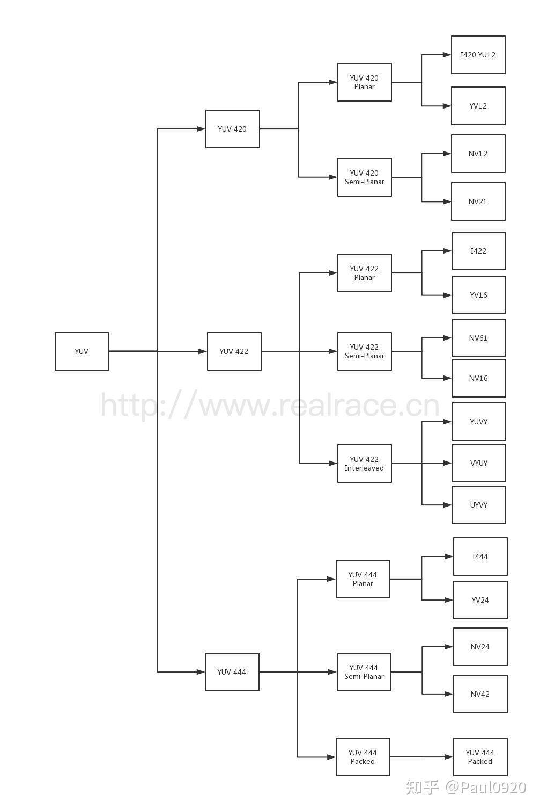

# 音视频基础知识

（来源[罗上文老师博客](https://ffmpeg.xianwaizhiyin.net/base-knowledge/raw-rgb.html)）

## RGB

    RGB色彩空间,分别表示Red,Green,Blue。

1. 像素格式：以**RGB24**为例子：其中R占8位，G占8位，B占8位，因此一个像素占24位，这种格式混合有 `256 * 256 * 256 = 16777216` 种颜色，故占用空间大。
2. 索引格式，RGB 的值是一个索引，不是真正的颜色值，例如 RGB 的值 占 1位，那只有两个值 0 跟 1，通常用于黑白颜色，这种情况下 一个像素只占 1位，大大节省了空间。0 跟 1 到底是什么颜色，是通过 索引表（也叫调色板）来定位的，不一定是 黑白，也可以是其他的颜色。所以叫索引格式。
   只占 1 位的 RGB 成为  **RGB1** ，还有 **RGB4** 占 4 位，索引表有 16 种颜色， **RGB8** 占 8 位，索引表有 256 种颜色。（不懂x……x）

   扩展知识：不需要 索引表/调色板 的 RGB 模式 称为  **真彩色** 。

### BMP文件格式概述

1. 什么是BMP
   BMP是常见的RGB文件格式，全称为Bitmap-File,是微软家出品的。是无损的。
2. BMP文件格式
   **文件头：**（14bytes）,存放文件相关信息；
   **信息头：**（40bytes），也可理解为**图像信息头** ，存放一些图像相关信息，如宽高之类的；
   **调试板：** 大小由颜色索引决定，将颜色表项的数量乘以每个颜色表项大小（4字节），如果一个BMP图像使用8位颜色深度，那么它将有256种颜色，颜色表的大小将是：颜色表大小=256×4字节=1024字节，RGB24为真彩色，没有用到调色板，所以这个区域是0字节。
   **位图数据:**   RGB数据，一个像素占3个字节

* BMP文件头

  BMP信息头 是从 第 15 个字节开始的，前面 14 个字节 被 BMP文件头 用了。第 15 ~ 18 字节是 BMP信息头 的大小。第 19 ~ 22 字节 是 图像的 **宽度** ，单位是像素。第 23 ~ 26 字节 是 图像的 **高度** ，单位是像素，第 27 ~ 28 字节是 color planes 的数量 ，通常是 01，第 29 ~ 30 字节是 指每个像素 需要多少 位来存储，第 31~ 34 字节是 压缩类型，没有压缩，是 0。第 35~ 38 字节是 图像大小，不包含 BMP文件头 跟 BMP信息头，其实 BMP文件头就有 总文件大小，第 39~ 42 字节是 **Width** resolution in pixels per meter，水平分辨率，第 43~ 45 字节是 **Height** resolution in pixels per meter，垂直分辨率，第 46~ 49 字节是 颜色表中的颜色索引数，本文没有索引表，是真彩色，第 50~ 53字节表示对图像显示有重要影响的颜色索引数码， 00 ：代表全都重要。

### FFmpeg处理bmp文件

FFmpeg 可以自由 转换 jpeg 跟 bmp，命令如下：

```
ffmpeg -i juren.jpg juren.bmp
```

```
ffmpeg -i juren.bmp juren.jpg
```

## YUV

    YUV色彩空间适合用于编码和存储，因此在在存储和编码之前，RGB 图像要转换为 YUV 图像，而 YUV 图像在 显示之前通常有必要转换回 RGB。

    为什么 YUV 色彩空间 在音视频开发，编码压缩领域更加常用，这个涉及到 HVS （Human Visual System）人类视觉系统 对 色彩空间的感知能力。视觉心理学研究表明，人的视觉系统对光的感知程度可以用两个属性来描述：**亮度（luminance）** 跟  **色度（chrominance）** ，这里的色度也叫做 饱和度或彩度。

**
    色度感知** 包含两个维度： **色调** （Hue）和  **色饱和度** （saturation）。色调是由光波的峰值定义的，描述的是光的颜色。色饱和度是由光波的谱宽定义的，描述的是光的纯度。

因此 HVS 对色彩的感知主要有 3个属性：亮度（luminance），色调（Hue）和 色饱和度（saturation）。也就是 YUV 色彩空间，Y 代表 亮度，U代表色调，V代表色饱和度。

    经过大量研究实验表明，**视觉系统 对 色度 的敏感度 是远小于 亮度的** 。所以可以对 色度 采用更小的采样率来压缩数据，对亮度采用正常的采样率即可，这样压缩数据不会对视觉体验产生太大的影响。简单来说就是用更少的数据/信息来表达 色度（chroma），用更多的数据/信息来表达 亮度（luminance）。

1. YUV分类

   YIQ 适用于NTSC彩色电视制式

   YUV 适用于PAL和SECAM彩色电视制式

   YCbCr适用于计算机用的显示器

YUV 里面的 U 就是 Cb ，术语是  **色调** （Hue）。V 就是 Cr ，术语是  **色饱和度** （saturation）。

实际上你可以把 UV 看成是 ，colour difference （色彩的差异），请看下图三条公式：

```
Cb=Blue−Y
```

```
Cr=Red−Y
```

```
Cg=Green−Y
```

Cb 代表 蓝色 色度的分量，是通过 RGB 里面的 B 的值 减去 Y 的值得到的。

Cr 代表 红色 色度的分量，是通过 RGB 里面的 R 的值 减去 Y 的值得到的。

Cg 代表 绿色色 色度的分量，是通过 RGB 里面的 G 的值 减去 Y 的值得到的。

### YUV420/YUV422/YUV444介绍

1. YUV444
   这个格式的占用空间最大，每一个Y分量用一组UV分量，                                                       单个像素占用空间为1byte(Y)+1byte(U)+1byte(V)=3byte										单帧占用空间为：frameSize = frameWidth * frameHeight * 3(byte)					所以YUV里面的各个分量比是1：1：1；
2. YUV422
   YUV422是每两个Y分量共用一个UV分量，所以一个像素占用2byte,                                       单个像素占用空间为：1byte(Y) + 1/2byte(U)+1/2byte(V)=2byte;                                  单帧占用空间：frameSize = frameWidth * frameHeight * 2(byte)
3. YUV420
   YUV420每四个Y分量公用一个UV分量，所以每个像素点占用1.5个byte空间，
   单个像素占用空间为：1byte(Y) + 1/4byte(U)+1/4byte(V) =1.5byte
   单帧占用空间：
   frameSize = frameWidth * frameHeight*1.5(byte)

### 具体文件格式

[参考知乎博客链接](https://www.zhihu.com/search?type=content&q=YUV420%E5%92%8CYUV444%E6%96%87%E4%BB%B6%E6%A0%BC%E5%BC%8F%E8%AF%A6%E8%A7%A3)



1. l420(属于YUV420 Plannar)
   数据分开存放，先是width * height长度的Y，后面跟着width * height * 0.25长度的U,最后是width * height * 0.25的V

   ```
   YYYY YYYY
   YYYY YYYY
   UUUU VVVV
   ```
2. YV12(属于YUV420 Plannar)
   YV12的数据与l42不同的是，先是width * height长度的Y，后面跟着width * height * 0.25长度的V,最后才是width * height * 0.25的U

   ```
   YYYY YYYY
   YYYY YYYY
   VVVV UUUU

   ```
3. NV12(属于 YUV 420 Semi-Planar)
   Y 分量单独存放，UV 分量交错存放，UV 在排列的时候，从 U 开始。总长度为 w * h * 1.5。

   ```
   YYYY YYYY
   YYYY YYYY
   UVUV UVUV
   ```
4. NV21 （属于 YUV 420 Semi-Planar）

   NV21 是 YUV 420 Semi-Planar 的一种，Y 分量单独存放，UV 分量交错存放，与 NV12 不同的是，UV 在排列的时候，从 V 开始。总长度为 w * h * 1.5。

   ```
   YYYY YYYY
   YYYY YYYY
   VUVU VUVU

   ```
5. l422(属于YUV 422 Plannar)

   I422 是 YUV 422 Planar 的一种，YUV 分量分别存放，先是 w * h 长度的 Y，后面跟 w * h * 0.5 长度的 U， 最后是 w * h * 0.5 长度的 V，总长度为 w * h * 2。

   ```
   YYYY YYYY
   YYYY YYYY
   UUUU UUUU
   VVVV VVVV
   ```
6. YV16（属于 YUV 422 Plannar）
   YV16 是 YUV 422 Planar 的一种，YUV 分量分别存放，先是 w * h 长度的 Y，后面跟 w * h * 0.5 长度的 V， 最后是 w * h * 0.5 长度的 U，总长度为 w * h * 2。与 I422 不同的是，YV16 是先 V 后 U。

   ```
   YYYY YYYY
   YYYY YYYY
   VVVV VVVV
   UUUU UUUU
   ```
7. NV16（属于 YUV 422 Semi-Planar）
   NV16 是 YUV 422 Semi-Planar 的一种，Y 分量单独存放，UV 分量交错存放，UV 在排列的时候，从 U 开始。总长度为 w * h * 2。

   ```
   YYYY YYYY
   YYYY YYYY
   UVUV UVUV
   UVUV UVUV
   ```
8. NV61（属于 YUV 422 Semi-Planar）
   NV61 是 YUV 422 Semi-Planar 的一种，Y 分量单独存放，UV 分量交错存放，UV 在排列的时候，从 V 开始。总长度为 w * h * 2。

   ```
   YYYY YYYY
   YYYY YYYY
   VUVU VUVU
   VUVU VUVU

   ```
9. YUVY（属于 YUV 422 Interleaved）
   YUVY 属于 YUV 422 Interleaved 的一种。事实上，Interleaved 是属于 Packed 的，但是在 422 中，用 Interleaved 更加形象一些。在 Packed 内部，YUV 的排列顺序是 Y U V Y，两个 Y 共用一组 UV。

   ```
   YUVY YUVY
   YUVY YUVY
   YUVY YUVY
   YUVY YUVY
   ```
10. VYUY（属于 YUV 422 Interleaved）
    VYUY 属于 YUV 422 Interleaved 的一种。在 Packed 内部，YUV 的排列顺序是 VYUY，两个 Y 共用一组 UV。

    ```
    VYUY VYUY
    VYUY VYUY
    VYUY VYUY
    VYUY VYUY
    ```
11. UYVY（属于 YUV 422 Interleaved）
    UYVY 属于 YUV 422 Interleaved 的一种。在 Packed 内部，YUV 的排列顺序是 UYVY，两个 Y 共用一组 UV。

    ```
    UYVY UYVY
    UYVY UYVY
    UYVY UYVY
    UYVY UYVY
    ```
12. I444（属于 YUV 444 Plannar）
    I444 属于 YUV 444 Plannar 的一种。YUV 分量分别存放，先是 w * h 长度的 Y，后面跟 w * h 长度的 U， 最后是 w * h 长度的 V，总长度为 w * h * 3。

    ```
    YYYY YYYY
    UUUU UUUU
    VVVV VVVV
    ```
13. YV24（属于 YUV 444 Plannar）
    YV24 属于 YUV 444 Plannar 的一种。YUV 分量分别存放，先是 w * h 长度的 Y，后面跟 w * h 长度的 V， 最后是 w * h 长度的 U，总长度为 w * h * 3。与 I444 不同的是，YV24 是先排列 V。

    ```
    YYYY YYYY
    VVVV VVVV
    UUUU UUUU
    ```
14. NV24（属于 YUV 444 Semi-Planar）
    NV24 是 YUV 444 Semi-Planar 的一种，Y 分量单独存放，UV 分量交错存放，UV 在排列的时候，从 U 开始。总长度为 w * h * 3。

    ```
    YYYY YYYY
    UVUV UVUV
    UVUV UVUV
    ```
15. YUV 444（属于 YUV 444 Semi-Planar）

    YUV444是YUV顺序存放

    ```
    YUV YUV YUV
    YUV YUV YUV
    ```

## YUV和RGB转换

    RGB转YUV的过程实际就是把RGB 3分量里面的亮度信息提取出来，放在Y分量中，再把RGB 3分量里面色调，色饱和度信息提取出来分给U和Y分量。

提取Y亮度信息公式如下：

```
Y = Kr * R +Kg * G +Kb * B
Kr + Kg + Kb = 1
Cb = B - Y
Cr = R - Y
Cg = G - Y
```

    `Kr`代表红色通道的权重，`Kg`代表 绿色通道的权重，`Kb` 代表 蓝色通道的权重，这三个权重加起来等于 1。

    `Cb` 就是 U 分量，`Cr` 是 V 分量。我们实际编码存储，或者传输的时候，是不需要用到 `Cg` 的。`Cr` + `Cb` + `Cg` 其实是一个常量。

    因为 K 权重因子是需要经过大量的实验才能得到，经过实验研究后发现，K 权重因子 会影响压缩率，所以产生了以下标准。

* **BT.601标准[1]——标清数字电视（SDTV)**

```
Y=0.299R+0.587G+0.114B
```

* **BT.709标准[2]——高清数字电视（HDTV)**

```
Y=0.2126R+0.7152G+0.0722B
```

* **BT.2020标准[3]——超高清数字电视（UHDTV)**

```
Y=0.2627R+0.6780G+0.0593B
```

因为某些原因，亮度这个信息，不能完完全全 从 RGB 里面提取出来，总会残留一些亮度信息在 RGB 里面没提取到。所以 K 权重因子 根据不同标准也是不同的。
